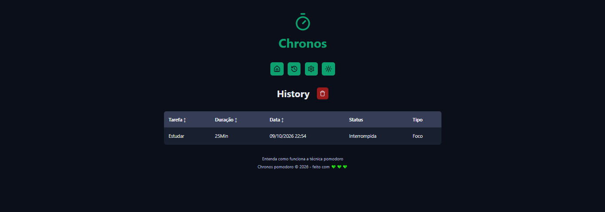

<div align="center">

# ⏱️ Chronos Pomodoro

**Gerenciador de tempo baseado na técnica Pomodoro, com histórico de tarefas e alerta sonoro.**

[](https://chronos-victor.vercel.app)


[**🔗 Ver projeto online**](https://chronos-victor.vercel.app)

</div>

---

## 🖼️ Telas

<div align="center">

### Home


### Histórico



### Configurações


</div>

## 📖 Sobre o projeto

O **Chronos** é um app de produtividade que aplica a técnica Pomodoro: você define uma tarefa, trabalha em ciclos de foco e alterna com pausas curtas e longas. Cada tarefa fica registrada em um histórico, que pode ser consultado e ordenado.

O projeto foi construído para praticar conceitos de React com TypeScript em uma aplicação completa, com gerenciamento de estado global, múltiplas páginas, Web Worker e deploy em produção.

## ✨ Funcionalidades

- ⏲️ **Timer Pomodoro** com contagem regressiva em tempo real
- 🔁 **Ciclos automáticos** de foco, pausa curta e pausa longa
- 📝 **Cadastro de tarefas** a cada ciclo de foco
- 🔔 **Alerta sonoro** ao final de cada ciclo
- 📜 **Histórico de tarefas** com nome, duração, data, status (ex.: interrompida) e tipo de ciclo, ordenável por tarefa, duração e data
- 🗑️ **Limpeza do histórico** com confirmação por toast
- ⚙️ **Configurações de tempo** para foco, descanso curto e descanso longo, salvas automaticamente
- 🌗 **Botão de tema** no menu de navegação
- 🧵 **Web Worker** para manter a contagem precisa em segundo plano

## 🛠️ Tecnologias

| Categoria | Ferramentas |
| --- | --- |
| Interface | React, TypeScript |
| Build | Vite |
| Estilização | CSS Modules, variáveis CSS |
| Estado global | Context API + `useReducer` |
| Contagem do tempo | Web Worker |
| Deploy | Vercel |

## 🚀 Como rodar localmente

**Pré-requisitos:** [Node.js](https://nodejs.org/) 22 ou superior e npm.

```bash
# 1. Clone o repositório
git clone https://github.com/VictorMendesON/chronos-pomodoro.git

# 2. Entre na pasta
cd chronos-pomodoro

# 3. Instale as dependências
npm install

# 4. Inicie o servidor de desenvolvimento
npm run dev
```

Depois, abra o endereço que aparecer no terminal (normalmente `http://localhost:5173`).

### Scripts disponíveis

| Comando | O que faz |
| --- | --- |
| `npm run dev` | Inicia o servidor de desenvolvimento |
| `npm run build` | Verifica os tipos com `tsc` e gera a versão de produção em `dist/` |
| `npm run preview` | Serve localmente a versão de produção |

## 🗂️ Estrutura do projeto

```text
src/
├── components/   # Componentes reutilizáveis (Container, CountDown, Menu, Dialog...)
├── Context/      # Estado global das tarefas (contexto, reducer e actions)
├── Models/       # Tipos e modelos do TypeScript
├── pages/        # Páginas (Home, History, Settings...)
├── routers/      # Rotas da aplicação
├── styles/       # Estilos globais e tema
├── utils/        # Funções auxiliares (próximo ciclo, status e ordenação de tarefas)
└── workers/      # Web Worker do cronômetro
```

## 💡 Aprendizados

- **Gerenciamento de estado com `useReducer` + Context API**, separando actions, reducer e provider.
- **Web Workers** para o cronômetro não depender do ritmo da aba principal.
- **Tipagem com TypeScript** em estado, ações e modelos de dados.
- **Deploy contínuo na Vercel:** cada push na `main` publica uma nova versão.
- **Diferença entre Windows e Linux nos nomes de arquivo:** o Windows ignora maiúsculas e minúsculas, mas a Vercel (Linux) não. Um `import` apontando para `styles.module.css` quebra o build se o arquivo no Git for `Styles.module.css`. A solução foi renomear com `git mv` e testar o build em um clone limpo do repositório.

## 👨‍💻 Autor

**Victor Mendes**
Desenvolvedor Front-End

[](https://github.com/VictorMendesON)
<!-- Adicione aqui seu LinkedIn e portfólio:
[](SEU_LINK)
[](SEU_LINK)
-->
